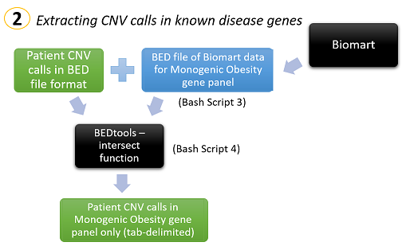

# CNV Analysis Project Summer 2019

Zahra Waheed  
email: zahra.w@hotmail.co.uk

### This repository contains scripts that form a Copy Number Variant (CNV) Analysis Pipeline, to:  
1. call CNVs from exome data  
2. identify CNVs within a gene panel  
3. annotate called CNVs in this panel using population frequency data from the gnomAD population (for annotation the 'gnomAD SV sites VCF' file was used: https://gnomad.broadinstitute.org/downloads)

**see schematic of pipeline below:**

  

  

  

#### The scripts for this project were applied to Monogenic Early Onset Obesity patients, but the overall pipeline can be applied to any rare disease cohort  

## Homozygosity Analysis
To extend the CNV analysis further, homozygosity maps for patients with consanguinous parents (produced using http://www.homozygositymapper.org/) were intersected with: a) Putative CNVs identified in the gene panel and b) SNVs identified in the gene panel. Scripts for each step can be found in the 'Homozygosity Analysis' folder  

## SNV Analysis
A script to extract SNVs from specific genes of a panel *(in this case, 22 green/high evidence genes from the Severe Early Onset Obesity gene panel from the Genomics England PanelApp database: https://panelapp.genomicsengland.co.uk/)* can be found in the 'SNV Analysis' folder

